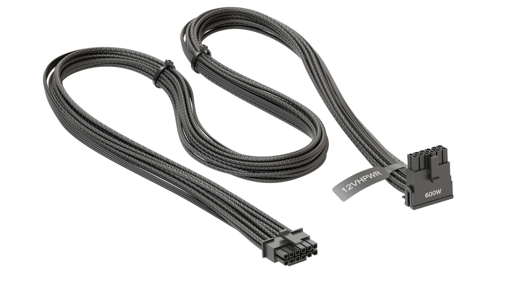

# <Tipo y nombre>
Cable 12VHPWR 
**Descripción breve:** Conector de alimentación de 16 pines para tarjetas gráficas de alta potencia 
**Pines/Carriles/Voltajes/Velocidad:** 16pines(12 de potencia, 4 de deteccion), hasta 600 W, no velocidad  
**Uso principal:** Suministrar potencia a las tarjetas gráficas de gama alta más modernas. 
**Compatibilidad actual:** Alta con GPUs modernas

## Identificación física

- 16pines(12 de potencia, 4 de señal), pines de potencia organizados en dos filas paralelas (6 + 6) y detras los pines de señal. 
Algunos pines tienen bordes cortados o esquinas biseladas para que no puedan insertarse al revés o mal orientados. 
Pueden ser negros o blancos. Pueden venir con texto “PCIe 5.0” o “12VHPWR” impreso o grabado, para identificar que es para GPU / potencia alta. 
Se encuentra en el lado superior o lateral, cerca de las salidas de energía de la tarjeta.
## Notas técnicas

- Verisones: 12VHPWR (H+), 12V-2x6 (H++).  
Limitaciones: Cada pin de potencia soporta hasta ~9.2 A, distribuidos entre los 12 pines principales. 
Calibre mínimo de AWG 16 (recomendado AWG 14 para GPUs >450 W) y longitud máxima de ≤ 750 mm 
Compatibilidad: solo con GPUs y PSUs con estándar PCIe 5.0 / ATX 3.0 o adaptadores oficiales.

## Fotos

##Fuentes
https://en.wikipedia.org/wiki/12VHPWR
