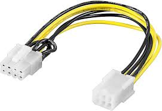

# Cable PCIe 6/8p

**Descripción breve:** Cable adaptador de alimentación para tarjetas gráficas. 
**Pines/Carriles/Voltajes/Velocidad:** 6/8 pines, 16 carriles, 75W(6p)/150W(8p), no velocidad(no transmiten datos) 
**Uso principal:** Alimentar tarjetas gráficas (GPU) de gama media y alta que requieren más energía de la que puede suministrar la placa base 
**Compatibilidad actual:** Alta

## Identificación física

- Conectores rectangulares, tiene llaves que impiden conectarlos incorrectamente, color amarillo +12V y negro: tierra, se encuentra en la fuente de alimentación.

## Notas técnicas

- No tienen versiones ya que solo entregan corriente, limitaciones de 75 W (6 pines), 150 W (8 pines), requisitos de 12 V, cable AWG16–18 , compatibilidad muy alta con GPUs PCIe desde hace 20 años

## Fotos

## Fuentes
https://hardzone.es/tutoriales/componentes/conectores-fuente-alimentacion/
https://www.corsair.com/es/es/explorer/diy-builder/power-supply-units/individual-8-pin-vs-pigtail-connectors-for-gpus/
