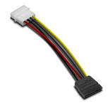

# Cable SATA Power

**Descripción breve:** es una interfaz de transferencia de datos
en serie entre la placa base y algunos dispositivos de almacenamiento.  
**Pines/Carriles/Voltajes/Velocidad:** 15 pines, No utiliza carriles (transmisión serial), 
+12V, +5V, +3.3V  
Velocidad: SATA 1.0: 1.5 Gbps / SATA 2.0: 3 Gbps / SATA 3.0: 6 Gbps / SATA 3.2 (o posterior): Hasta 12 Gbps  
**Uso principal:** Suministra energía directamente desde la fuente de alimentación al disco duro o unidad óptica.  
**Compatibilidad actual:** Alta

## Identificación física

Tiene forma de L con colores amarillo rojo y negro y se encuentra en la fuente de poder.

## Notas técnicas

Versiones: SATA I, II y III
Necesita ser suministrado por la fuente de alimentación del ordenador.
El cable de datos SATA tiene 7 pines y permite la conexión de una sola unidad. 

## Fotos

## Fuentes
https://www.ordenatech.es/conector-sata-caracteristicas-y-ventajas/
pc-workstation/guia-para-principiantes-sobre-cables-sata-todo-lo-que-necesitas-saber/
