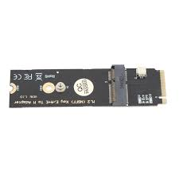

# Slot: M.2 Wi-Fi

**Descripción breve:** ranura de expansión compacta (Next Generation Form Factor o NGFF) que se encuentra en
ordenadores modernos yque permite conectar una tarjeta de módulo para redes inalámbricas, como la conexión Wi-Fi y Bluetooth.
**Pines/Carriles/Voltajes/Velocidad:** 
- Pines y carriles: Utiliza la interfaz PCIe, no SATA, ya que ofrece mayor velocidad.
- Voltaje: 3.3V
- Velocidad: Wi-Fi 5 (1.3 Gb/s), Wi-Fi 6 (2.4 Gb/s), Wi-Fi 6E / 7 (4.8 Gb/s o más)
**Uso principal:** El uso principal de una ranura M.2 para Wi-Fi es para instalar un módulo de red inalámbrica, como una
tarjeta Wi-Fi/Bluetooth, que aprovecha esta interfaz de factor de forma compacto para conectarse directamente a la placa base del ordenador.
**Compatibilidad actual:** Alta

## Identificación física
- Pequeño y rectangular, y tiene una sola muesca (Key E) situada hacia el lado izquierdo
- Son generalmente verdes, y el slot suele ser negro o beige en la placa base.
- En la placa suele aparecer serigrafiado como “M.2 (Wi-Fi)”, “E Key”, “CNVi”, o “WLAN”.
- Está cerca de las salidas de audio o USB traseras de la placa base (zona superior-trasera) o junto a las ranuras PCIe.

## Notas técnicas
- Versiones
- Limitaciones: Las principales limitaciones al usar un slot M.2 para Wi-Fi son el tipo de slot y el ancho de banda,
ya que un slot para Wi-Fi no puede ser utilizado para un SSD NVMe de alta velocidad.
- No requiere cable
- Hz: 100 MHz en el bus PCIe / GT/s: 5 GT/s (PCIe 2.0 x1) o 8 GT/s (PCIe 3.0 x1)

## Fotos

## Fuentes
https://www.assured-systems.com/es/faq/what-is-a-m-2-key/#:~:text=La%20llave%20M.,ordenadores%20y%20dispositivos%20port%C3%A1tiles%20modernos.
https://www.corsair.com/es/es/explorer/glossary/what-is-m2/#:~:text=Switch%20to%20English-,M.,ser%20m%C3%B3dulos%20Bluetooth%20o%20WiFi.
