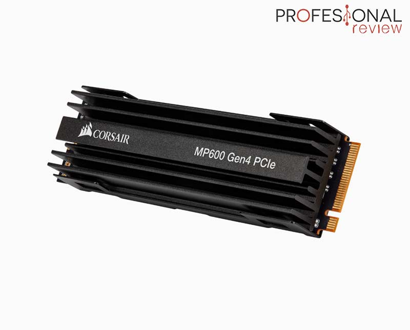

# Slot: PCIe Gen4

**Descripción breve:** es la cuarta generación de la interfaz Peripheral Component Interconnect Express,
que duplica la velocidad de datos de su predecesor, PCIe 3.0.  
**Pines/Carriles/Voltajes/Velocidad:** Carriles y pines: x1(18p),4(32p),x8(49),x16(82) / Velocidad por carril: 16GT/s 
**Uso principal:** Permite la conexión de dispositivos de alto rendimiento, como tarjetas gráficas (GPU) y unidades de estado sólido (SSD) NVMe, ofreciendo un mayor ancho de banda y velocidad para aplicaciones exigentes.  
**Compatibilidad actual:** Alta

## Identificación física
- Rectangular largo, con una sola muesca (llave) hacia un extremo. 
- Suelen ser negros o gris metalizado 
- Serigrafiado en la placa como “PCIEX16_1”, “PCIe 4.0 x16” o “PCIe Gen 4”. Algunos modelos también marcan “x16_4.0” para distinguirlo del 3.0. 
- Generalmente es el primer slot debajo del procesador (CPU), el más cercano al socket.
  
## Notas técnicas
- Versione: PCIe 4.0 
- Retrocompatible con PCIe 3.0 y 2.0 (funciona pero a menor velocidad). El rendimiento real depende del número de carriles activos (x4, x8, x16). 
- Ofrece hasta 31.5 GB/s en x16, opera a 100 MHz, usa 12 V y 3.3 V, no tiene PD 
- Alcanza 16 GT/s por carril..

## Fotos

## Fuentes
https://www.kingston.com/unitedkingdom/latam/blog/pc-performance/pcie-gen-4-explained#:~:text=PCIe%20Gen%204%20duplica%20la,por%20segundo)%20por%20carril%20PCIe.
https://www.adata.com/ar/quikTips/pcie3-vs-pcie4-speed-compatibility/
https://www.intel.la/content/www/xl/es/gaming/resources/what-is-pcie-4-and-why-does-it-matter.html#:~:text=PCIe%20(Peripheral%20Component%20Interconnect%20Express,4.0%20a%20una%20ranura%203.0.
