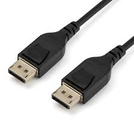

# Conector DisplayPort 1.4

**Descripción breve:** permite reproducir vídeos de hasta 7680 x 4320 (8K) a 60Hz con un ancho de banda de 32,4 Gb/s,
y soporta la mayoría de los formatos de vídeo en 3D 
**Pines/Carriles/Voltajes/Velocidad:** 20 pines, 4 carriles, no voltajes, ancho de banda: 32,4 Gbps (total), velocidad de datos: 25,92 Gbps
**Uso principal:** Permite actualizaciones de pantalla «parciales» desde la GPU,
especialmente cuando se trata de páginas o contenido estático en una parte de la pantalla con la que no está interactuando.  
**Compatibilidad actual:** Alta
## Identificación física
- Forma: rectangular
- Llaves: tiene una muesca o bisel en la parte superior que asegura la orientación correcta.
- Colores: Generalmente negro, gris oscuro o plateado.
- Simbolos: Lleva grabado o impreso el logo “DP” / Algunos cables certificados muestran “HBR3 / 1.4” indicando la versión y ancho de banda.
- Ubicacion: El conector principal suele estar en el panel trasero de la GPU o monitor, y el mini DP en el lateral o trasero de laptops.

## Notas técnicas
- Versiones: DP 1.0 / 1.1  / DP 1.2 / DP 1.3 / DP 1.4
- Limitaciones: Para 8K o 4K a 120 Hz se requiere DSC / Limitado por el tipo de cable / No transporta energía significativa
- Requisitos de cable: Cable certificado HBR3 / DP 1.4 para 32.4 Gbps. / Longitud recomendada: hasta 2 m sin pérdida
- Hasta 120 Hz en 4K / 60 Hz en 8K con DSC / Hasta 8.1 GT/s por línea en HBR3, 4 líneas → 32.4 Gbps

## Fotos

## Fuentes
https://ibericavip.com/blog/pc-workstation/displayport-1-4a-vs-2-0-2-1-en-la-tarjeta-grafica-por-que-es-importante/
https://compukaed.com/tienda/cables/video/displayport/cable-displayport-dp-1-4-de-1-80-metros-ultra-hd-8k-a-60hz-4k-a-144hz-forrado-en-nylon-netcom/
https://fycables.com/es/what-is-displayport-1-4/
