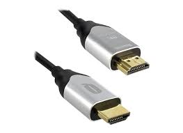

# Conector HDMI 2.1

**Descripción breve:** HDMI 2.1 es la última versión del estándar para transmitir audio y video . 
**Pines/Carriles/Voltajes/Velocidad:** 19 pines, no se especifican carriles ni voltaje. 
Velocidad: Ancho de banda: Hasta 48 Gbps / Resoluciones soportadas: Hasta 8K a 60Hz y 4K a 120Hz sin compresión 
**Uso principal:** El uso principal del HDMI 2.1 es transmitir vídeo y audio de alta calidad con un mayor ancho de banda,
permitiendo resoluciones de hasta 10K y 8K a 60Hz, y 4K a 120Hz. 
**Compatibilidad actual:** Alta

## Identificación física
- Forma: conector plano y ancho
- Llaves: tiene una muesca interna asimétrica 
- Colores: Color negro o gris metálico.
- Simbolos: Lleva grabado o impreso el logo “HDMI”, a veces acompañado de “2.1” o “Ultra High Speed”.
- Ubicacion: En la parte trasera o lateral de televisores, monitores, consolas (PS5, Xbox Series X/S),
tarjetas gráficas, receptores AV, portátiles y proyectores, en placas base o GPUs, normalmente está en el panel trasero de E/S.

## Notas técnicas
- Versiones: HDMI 1.4: hasta 10.2 Gbps → 4K a 30 Hz / HDMI 2.0: hasta 18 Gbps → 4K a 60 Hz / HDMI 2.1: hasta 48 Gbps → 8K a 60 Hz o 4K a 120 Hz
- Limitaciones: Para aprovechar sus funciones, el dispositivo, el cable y la pantalla deben ser HDMI 2.1. / Los cables antiguos limitan el ancho de banda.
- Requisitos del cable: Se necesita un cable “Ultra High Speed HDMI” certificado / Blindaje reforzado / Compatible con HDCP 2.3 y eARC
- Hz: Hasta 120 Hz en 4K / 60 Hz en 8K / GT/s: 12 GT/s por línea, 4 líneas → 48 GT/s total
  
## Fotos

## Fuentes
https://es.wikipedia.org/wiki/High-Definition_Multimedia_Interface
https://cabletimetech.com/es-es/blogs/knowledge/3-ways-to-identify-hdmi-2-1-cables
