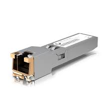

# Modulo RJ-45 1G

**Descripción breve:** Módulo SFP de cobre diseñado para quienes requieren una solución robusta y adaptable para su red  
**Pines/Carriles/Voltajes/Velocidad:**  8 pines, 4 carriles trenzados, voltaje ±2.5 V por par, 1Gbps full duplex  
**Uso principal:** Su función es conectar dispositivos como ordenadores, routers, switches, impresoras y consolas de 
videojuegos a la red de área local (LAN) para la transmisión de datos y acceso a Internet.  
**Compatibilidad actual:** Alta

## Identificación física
- Forma: cocector rectangular de plástico
- Llaves: posee una pestaña plástica de retención en la parte superior que asegura la conexión y evita que se desconecte accidentalmente.
- Pueden ser amarillo, azul, gris, rojo, verde o negro.
- Algunos conectores llevan grabado el logo “Ethernet” o un símbolo de red.
- Se encuantra en el panel trasero de PCs, servidores o equipos de red, y también en paredes con rosetas RJ45 para cableado estructurado.

## Notas técnicas
- Versiones: 10BASE-T / 100BASE-TX / 1000BASE-T / 10GBASE-T
- Limitaciones: Alcance máximo de 100 metros / Limitado a par trenzado balanceado
- Requisitos del cable: Cable Cat5e mínimo para 1 Gbps; Cat6 o superior recomendado para estabilidad
- 125 MHz para Gigabit Ethernet

## Fotos

## Fuentes
https://www.sincables.com.ec/product/ubiquiti-uf-rj45-1g-modulo-sfp-1g-puerto-gigabit-rj45/ 
https://seetronic.com/es/blog/what-is-an-rj45-connector/ 
https://www.assured-systems.com/es/faq/what-is-a-rj-45/
