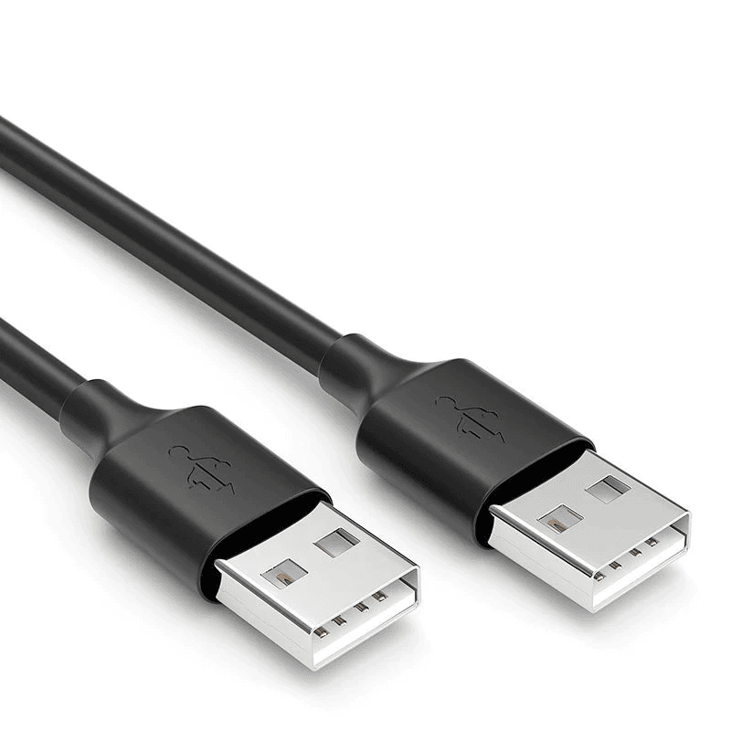

# Conector USB-A 2.0

**Descripción breve:** Es un estándar de conexión USB que se caracteriza por su conector rectangular (USB-A) y
una velocidad de transferencia de datos de hasta 480 Mbps. 
**Pines/Carriles/Voltajes/Velocidad:** 
- Pines: 4 pines [Pin 1 (VBUS), Pin 2(D-), Pin 3(D+), Pin 4 (GND)
- Carriles: 2 (D- y D+)
- Voltaje: 5V
- Velocidad: 480 Mbps (en la teoria), 280 Mbps (practica) 
**Uso principal:** Permiten transferir datos, imágenes, vídeos y archivos en general a una velocidad de 60 Mb por segundo.
Gracias a esto, se ha convertido en la versión más común de entradas en la mayoría de los ordenadores y dispositivos informáticos. 
**Compatibilidad actual:** Alta

## Identificación física
- Forma: Rectangular
- Color: Negro (color mas comun)
- Simbolo: El símbolo del tridente es la clave para identificarlo.
- Ubicacion: Normalmente se encuentran en la parte trasera de los PCs de escritorio o en los laterales de los portátiles.

## Notas técnicas
- Versiones: Sucesor del USB 1.1
- Velocidad máxima: 480 Mbps (0.48 Gbps) / No soporta vídeo ni modos alternativos (solo datos y energía) / Potencia limitada: 5 V a 0.5 A → 2.5 W máximo.
- Requisitos del cable: Usa 4 hilos internos, 2 de energía (VCC, GND) y 2 de datos (D+, D−) / Longitud recomendada: máximo 5 m para mantener buena señal.
- Hz: 480 MHz

## Fotos

## Fuentes
https://es.wikipedia.org/wiki/Universal_Serial_Bus 
https://www.pcbasic.com/es/blog/usb_pinout.html 
https://www.xataka.com/basics/tipos-usb-estandares-conectores-caracteristicas-cada-uno 
https://www.anker.com/blogs/cables/how-to-identify-different-types-of-usb-cables-a-brief-guide
