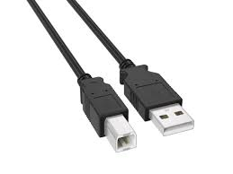

# Conector USB-B

**Descripción breve:** Es un tipo de conector empleado para comunicar dispositivos con el PC u otros ordenadores
**Pines/Carriles/Voltajes/Velocidad:** 
- Pines: El USB tipo B tiene 4 o 5 pines (VBUS/alimentación, D-/datos, D+/datos, GND/tierra)
- Voltaje: 5V
- Carriles: No utiliza carriles de datos en el mismo sentido que el USB-C
- Velocidades: Dependen del estándar USB como 480 Mbps para USB 2.0 y hasta 10 Gbps para USB 3.2 Gen 2,
que usa conectores Micro-USB 3.0 de 10 pines 
**Uso principal:** Se utiliza principalmente en dispositivos que tradicionalmente han contado con este puerto, como routers, impresoras y fotocopiadoras. 
**Compatibilidad actual:** Media

## Identificación física
- Forma: Casi cuadrada
- Llaves: posee una muesca interna que evita insertarlo al revés (solo entra en una dirección).
- Colores: Negro, Azul, Turquesa o celeste
- Símbolos: Lleva el símbolo universal USB (tridente con tres puntas: flecha, círculo y cuadrado).
- Se encuantra en la parte trasera de impresoras, escáneres, interfaces de audio, hubs o discos duros externos.
## Notas técnicas
- Versiones: USB-B 1.1, USB-B 2.0, USB-B 3.0 / 3.1
- Limitaciones: Tamaño físico grande → no apto para dispositivos compactos, no transporta vídeo ni modos alternativos (solo datos y energía), no reversible (solo entra de una forma)
- Requisitos de cable: USB-B 2.0: 4 hilos / USB-B 3.0: 9 pines, longitud máxima recomendada: 5 m (USB 2.0) o 3 m (USB 3.0).
- Hz: 480 MHz en USB 2.0 / ~5 GHz en USB 3.0
## Fotos

## Fuentes
https://www.pcbasic.com/es/blog/usb_pinout.html 
https://hilelectronic.com/es/usb-pinout/ 
https://opencircuit.es/blog/usb-a-b-c-mini-micro-welke-usb-kabel-heb-je

