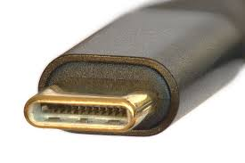

# Conector externo: USB-C (USB4/PD)

**Descripción breve:** Conector reversible para datos, vídeo y alimentación (PD).  
**Pines/Carriles/Voltajes/Velocidad:** 24 pines · USB4 hasta 40 Gbps · PD hasta 100–240 W (según perfil)  
**Uso principal:** Carga y conexión de periféricos/monitores/docks  
**Compatibilidad actual:** Alta (ojo: no todo USB-C soporta TB/PD)

## Identificación física
- Ovalado y simétrico; símbolos: rayo (Thunderbolt), “SS” (SuperSpeed).

## Notas técnicas
- Requisitos de cable para 40 Gbps/240 W; DP Alt Mode para vídeo si no es TB.

## Fotos

## Fuentes
- https://usb.org/
https://www.lenovo.com/es/es/glossary/what-is-usb-c/#:~:text=%C2%BFQu%C3%A9%20es%20el%20bus%20serie,opci%C3%B3n%20conveniente%20para%20muchos%20usuarios.
https://www.att.com/es-us/wireless/what-is-usb-c-charger/
